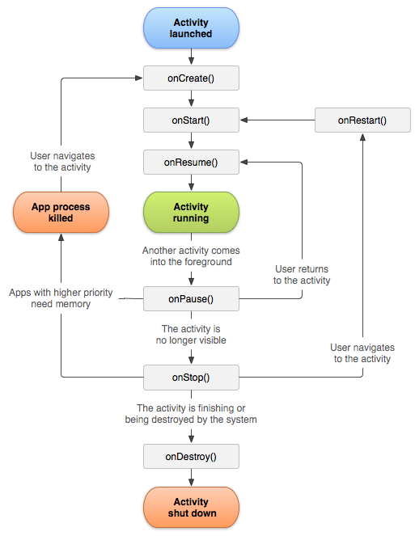

# Interview Questions on Activity

1. About Android as a component
   * It is a core component of android
   * It serves as the base for any UI based application
   * Multiple activity can be difficult to maintain and communicate with each other. It also poses significant resistance to UI design scalability and flexibility when only activity is chosen.
   * Common approach currently is to go for a single activity with multiple fragments.
   * [To declare your activity, open your manifest file and add an <activity> element as a child of the <application> element.](https://developer.android.com/guide/components/activities/intro-activities#da)
     ```
       <manifest ... >
         <application ... >
           <activity android:name=".ExampleActivity" />
               ...
         </application ... >
          ...
       </manifest >
       ```
   * [***android:exported*** needs to be explicitly specified for <activity>, it is for apps targeting Android 12 and higher.](https://stackoverflow.com/questions/68554294/androidexported-needs-to-be-explicitly-specified-for-activity-apps-targeting)
     ```
       <activity
           android:name=".app.presentation.NavHostActivity"
           android:exported="true">
               ...
       </activity>
     ```

2. [Activity lifecycle](https://developer.android.com/guide/components/activities/activity-lifecycle)

    - As a user navigates through, out of, and back to your app, the Activity instances in your app transition through different states in their lifecycle. The Activity class provides a number of callbacks that allow the activity to know that a state has changed: that the system is creating, stopping, or resuming an activity, or destroying the process in which the activity resides.



3. [onNewIntent callback](https://developer.android.com/reference/android/app/Activity?hl=en#onNewIntent(android.content.Intent))
    * [Relevant SO answer](https://stackoverflow.com/a/8357327/2694480)
    * This is called for activities that set launchMode to ["singleTop"](https://developer.android.com/guide/topics/manifest/activity-element#lmode) in their package, or if a client used the [FLAG_ACTIVITY_SINGLE_TOP](https://developer.android.com/reference/android/content/Intent#FLAG_ACTIVITY_SINGLE_TOP) flag when calling startActivity(Intent).

    * If you set to single top, the activity will not be launched if it is already running at the top of the history stack. It will not relaunch just show from stack.

5. [Activity state and ejection from memory](https://developer.android.com/guide/components/activities/activity-lifecycle#asem)

   * The system kills processes when it needs to free up RAM; the likelihood of the system killing a given process depends on the state of the process at the time.

       |Likelihood of being killed|Process state|Activity state|
       |--------------------------|-------------|--------------|
       |Least 	|Foreground (having or about to get focus) 	|Created Started Resumed|
       |More|Background (lost focus)|Paused|
       |Most|Background (not visible)|Stopped|
       | |Empty|Destroyed|

6. [Launch Modes](https://developer.android.com/guide/components/activities/tasks-and-back-stack?hl=en#TaskLaunchModes)
   * Launch modes allow you to define how a new instance of an activity is associated with the current task. You can define different launch modes in two ways:
     * [Using the manifest file](https://developer.android.com/guide/components/activities/tasks-and-back-stack?hl=en#ManifestForTasks)
     * [Using Intent flags](https://developer.android.com/guide/components/activities/tasks-and-back-stack?hl=en#IntentFlagsForTasks)